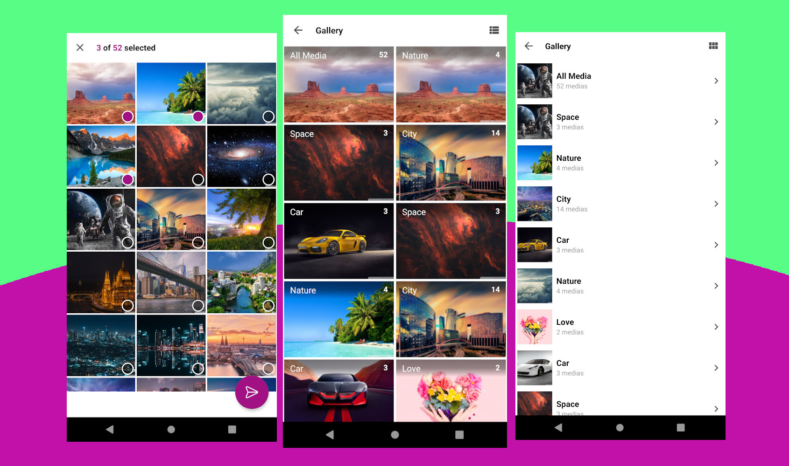

# Fallery [](https://jitpack.io/#mehdiyari/Fallery)

A fully customizable gallery and media picker for android

# Demo



# Features

1. Select media(photo, video) from android media store with custom [offline gallery](http://mehdiyari.ir/2020/08/14/create-a-custom-offline-online-gallery-with-fallery/) or custom [online gallery](http://mehdiyari.ir/2020/08/14/create-a-custom-offline-online-gallery-with-fallery/)
2. Compatible with android API Level 14 to 30
3. Content Observer
4. Filter media based on types(Photos, videos, both)
5. Modern user interface with the capability to add new themes and languages
6. Select media with a caption
7. Taking photos from the camera with the intent
8. Showing bucket list in two different UI(grid and linear) which user can switches between them in runtime
9. Support setting max selectable media by user
10. Support orientation
11. Support custom edit text layout for caption(for emoji compatibility, etc)
12. Enable or disable media counts in fallery toolbar
13. Support Vertical, Horizontal scrolling in showing media view-pager
14. Support any view-pager transformer in media view-pager
15. Support custom onClick for video toggle in the video preview screen
16. Automatic grant external storage permissions
17. Automatic grant shared storage permissions(only for android +10)
18. Easy to use

## Usage
### Gradle
Step 1. Add it in your root `build.gradle` at the end of repositories:
```gradle
allprojects {
  repositories {
	maven { url 'https://jitpack.io' }
  }
}
```
Step 2. Add the dependency
```gradle
dependencies {
  implementation 'com.github.mehdiyari:Fallery:{latest_version}'
}
```
### Maven
```xml
<repositories>
  <repository>
	 <id>jitpack.io</id>
	 <url>https://jitpack.io</url>
  </repository>
</repositories>
```
```xml
<dependency>
  <groupId>com.github.mehdiyari</groupId>
  <artifactId>Fallery</artifactId>
  <version>{latest_version}</version>
</dependency>
```
### Simple Using
Kotlin
```Kotlin
class MainActivity : AppCompatActivity(R.layout.activity_main) {
    
      override fun onCreate(savedInstanceState: Bundle?) {
          super.onCreate(savedInstanceState)
          
          val falleryOptions = FalleryBuilder()
                .setImageLoader(YourImageLoader())
                .setMediaObserverEnabled(true)
                .build()

          falleryButton.setOnClickListener {
              startFalleryWithOptions(requestCode = 1, falleryOptions = falleryOptions)
          }
      }

      override fun onActivityResult(requestCode: Int, resultCode: Int, data: Intent?) {
          super.onActivityResult(requestCode, resultCode, data)
          if (requestCode == 1 && resultCode == RESULT_OK && data != null) {
              handleResultWithCaption(
                result = data?.getFalleryResultMediasFromIntent(),
                caption = data?.getFalleryCaptionFromIntent()
              )
          }
      }

     private fun handleResultWithCaption(result: Array<String>?, caption: String?) {
        TODO("handle result and caption")
    }
}
```

Java
```Java
public class MainActivity extends AppCompatActivity {

    private Button button;
    
    @Override
    protected void onCreate(Bundle savedInstanceState) {
        super.onCreate(savedInstanceState);
        setContentView(R.layout.activity_main);

        final FalleryOptions falleryOptions = new FalleryBuilder()
                .setImageLoader(YourImageLoader())
                .build();

        this.findViewById(R.id.button).setOnClickListener(new View.OnClickListener() {
            @Override
            public void onClick(View v) {
                Fallery.startFalleryFromActivityWithOptions(
                        MainActivity.this, 1, falleryOptions
                );
            }
        });
    }

    @Override
    protected void onActivityResult(int requestCode, int resultCode, @Nullable Intent data) {
        super.onActivityResult(requestCode, resultCode, data);
        if (requestCode == 1 && resultCode == RESULT_OK && data != null) {
            String[] result = Fallery.getResultMediasFromIntent(data);
            String caption = Fallery.getCaptionFromIntent(data);
            handleResultWithCaption(result, caption);
        }
    }

    private void handleResultWithCaption(String[] result, String caption) {
        // todo: handle result and caption
    }
}
```
For more details about how to using Fallery please check example module or [Fallery blog post](http://mehdiyari.ir/2020/08/14/fallery-a-fully-customizable-media-picker-for-android/).

## Contribute

If you have free time I would very much appreciate your contributions.

## License

    Copyright 2021 Mehdi Yari

    Licensed under the Apache License, Version 2.0 (the "License");
    you may not use this file except in compliance with the License.
    You may obtain a copy of the License at

       http://www.apache.org/licenses/LICENSE-2.0

    Unless required by applicable law or agreed to in writing, software
    distributed under the License is distributed on an "AS IS" BASIS,
    WITHOUT WARRANTIES OR CONDITIONS OF ANY KIND, either express or implied.
    See the License for the specific language governing permissions and
    limitations under the License.
